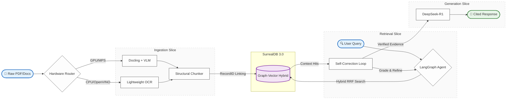

# CodaCite: GraphRAG-based Document Intelligence


CodaCite is a high-performance, local-first RAG (Retrieval-Augmented Generation) engine designed to transform static documents into dynamic, graph-linked knowledge bases. Built for speed, precision, and verifiability, it leverages **SurrealDB 3.0** as a hybrid graph-vector store to enable multi-hop reasoning with character-level citation accuracy.

## 🌟 Why CodaCite? (The Manifesto)

Standard RAG pipelines often hallucinate or lose context across complex document hierarchies. CodaCite solves this through five non-negotiable pillars:

1. 🎯 **Absolute Provenance**: Every AI-generated claim is anchored to a specific character offset (`start_char`, `end_char`) in the source document. No blind trust.
2. 🧠 **Graph-Augmented Retrieval**: Relationships are not just stored; they are traversed. CodaCite provides multi-hop context that traditional vector search misses.
3. 🔄 **Self-Correcting Reasoning**: Powered by LangGraph, the system grades its own retrieved context, rewrites queries, and loops until it achieves engineering-grade precision.
4. 🔒 **100% Local Sovereignty**: Zero data leakage. All inference (LLM, Embeddings, OCR) is executed on-premises via Podman on consumer-grade hardware.
5. 🧬 **Anaphora Resolution**: Advanced coreference resolution ensures that "it," "they," or "this system" are correctly mapped to their entities across chunk boundaries, maintaining semantic continuity.

## ✨ Elite Capabilities

* **Entity Resolution & Semantic Blocking**: Employs a two-stage merge pipeline (Blocking + Cross-Encoder) to deduplicate entities across thousands of pages without O(N²) complexity.
* **Recursive Map-Reduce Summarization**: Enables local summarization of massive document sets by recursively reducing information density within a sliding 4k context window.
* **Structural Context Chunking**: Achieves a **95% reduction in CPU overhead** by preserving document hierarchy (H1-H3) during ingestion, allowing for perfect semantic snapshots.
* **VRAM-Aware Dynamic Routing**: Automatically probes hardware at runtime to route heavy VLM tasks to GPU/MPS while falling back to optimized **OpenVINO** paths for CPU inference.
* **Hybrid RRF Search Engine**: Combines **BM25 (lexical)** and **HNSW (semantic vector)** search via Reciprocal Rank Fusion (RRF) for "zero-failure" discovery of both concepts and specific serial numbers.

## 🏗️ Architecture: Vertical Slice Design

CodaCite utilizes a **Vertical Slice Architecture** (Modular Monolith) to ensure feature autonomy. Each slice encapsulates its own logic, models, and domain rules.



### Directory Layout

```text
codacite/
├── app/
│   ├── core/         # Shared foundational interfaces & DI
│   ├── db/           # SurrealDB schemas (v3.x) & Store Adapters
│   ├── pipelines/    # Feature Slices (Ingestion, Extraction, Retrieval, Generation)
│   └── api/          # FastAPI routes & documentation endpoints
└── docs/             # Engineering Manifesto & Architecture Records
```

## 🛠️ Tech Stack

* **Database**: [SurrealDB v3.0](https://surrealdb.com/) (Modern Rust-based Graph Engine)
* **Intelligence**:
  * **Embeddings**: BGE-M3 (FastEmbed) for multi-vector support.
  * **Generation**: DeepSeek-R1 (Local Llama.cpp) & Gemini (Multimodal Fallback).
  * **Orchestration**: `LangGraph` for stateful agentic reasoning.
* **Runtime**: Python 3.13+ managed by `uv`, rootless containers via **Podman**.

## 🚀 Getting Started

### 1. Prerequisites

Install `uv` (the wildly fast Python package manager):

```bash
curl -LsSf https://astral.sh/uv/install.sh | sh
```

### 2. Environment Setup

```bash
git clone https://github.com/foersben/codacite
cd codacite
uv venv && source .venv/bin/activate
uv sync
```

### 3. Spin up Infrastructure

```bash
podman-compose up -d
```

### 4. Run the Engine

```bash
uv run python -m app.main
```

## 🗺️ Roadmap

* [x] **Vertical Slice Refactor**: Migrated from Hexagonal to Modular Monolith (2026-05).
* [x] **SurrealDB 3.x Migration**: Fully updated query syntax (@@ match) and schema indices.
* [x] **Infrastructure Stabilization**: Refined HNSW index dimensions and hybrid search scoring.
* [x] **Global Docstring Audit**: Synchronized entire codebase with Google-style standards.
* [x] **Agentic Context Layer**: Formalized `agent_context.md` for seamless AI pair-programming.
* [ ] **Graph Extraction Optimization**: Batched LLM relationship mapping for Phase 6.
* [ ] **Multi-Modal Parsing**: Integration of `Qwen2-VL` for schematic analysis.

## 🤖 Agent Workspace

Developers can utilize specialized slash commands in an Antigravity-supported environment:

* `/bootstrap`: Rebuild environment.
* `/implement`: Build a new feature slice.
* `/qa-pass`: Generate unit tests for a slice.
* `/commit`: Standardized pre-commit checks.

## 📚 Documentation Compass

For deep technical specifications, refer to our specialized documentation:

* [**Agent Context**](docs/agent_context.md): Essential onboarding and troubleshooting for AI coding assistants.
* [**Architecture Manifesto**](docs/architecture.md): The core design philosophy.
* [**Core Concepts**](docs/concepts.md): Deep-dives into GraphRAG and Citation logic.
* [**Infrastructure Guide**](docs/infrastructure.md): SurrealDB 3.x and Podman setup.
* [**Verification Matrix**](docs/operations.md#verification-matrix): Procedures for pipeline validation.

---
© 2026 CodaCite Contributors. Released under the MIT License.
