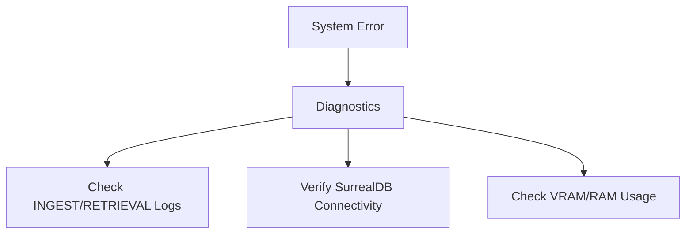

# Appendix A: Developer Context & Troubleshooting

This appendix provides the specialized heuristics and context required for AI agents to maintain and extend the CodaCite codebase.

## A.1 Development Heuristics

* **Vertical Slice Priority**: When adding a feature, start by creating a new directory in `app/pipelines/`.

* **Zero-Bypass CI**: No code may be committed without passing `ruff` and `mypy` checks.

* **Textbook Documentation**: Maintain the formal, pedagogical tone established in the `docs/` suite.

## A.2 Key State Objects

1. **Chunk Model**: Contains the raw text, the 1024D embedding, and the `start_char`/`end_char` provenance.

2. **Notebook Model**: The primary security and retrieval boundary.

## A.3 Deployment Checklist

* **Environment**: Ensure `UV_CACHE_DIR` and `UV_PYTHON_INSTALL_DIR` are set.

* **Database**: Verify SurrealDB 3.0.5 connectivity via `surreal sql`.

* **Coreference Resolution**: The `fastcoref` engine may occasionally fail to resolve nested possessive pronouns. The current workaround involves a pre-processing step that flattens complex clauses.

* **UTF-8 Normalization**: Always ensure documents are processed through the `NormalizationPort` before chunking. Non-normalized text can lead to character offset drift in the final provenance metadata.

### Infrastructure & Networking

## A.3 Troubleshooting Matrix

| Symptom | Probable Cause | Resolution |
| :--- | :--- | :--- |
| `CUDA Out of Memory` | Redundant model initialization | Verify that all models are implemented as singletons via the DI container. |
| `Record not found` | Transactional race condition | Ensure that relations (Edges) are only created after both Nodes have been successfully committed. |
| Empty Retrieval Results | Alpha ($\alpha$) mismatch | Adjust the hybrid search weighting to favor lexical matching (increase $\alpha$) for specialized terminology. |

