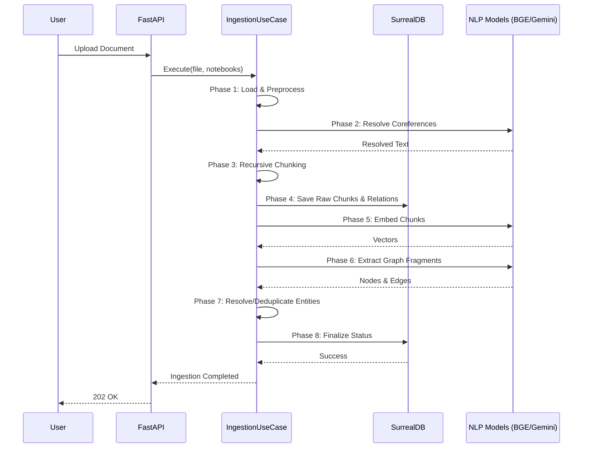
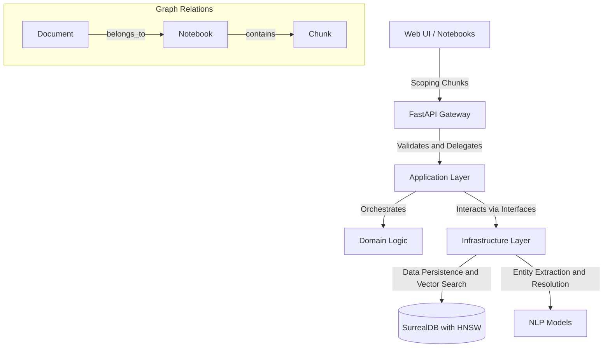

# Architecture

The architecture of CodaCite represents a sophisticated synthesis of modern data processing paradigms, unified under a rigorous Hexagonal Architecture. This structural philosophy, also known as the Ports and Adapters pattern, strictly isolates the core business logic from the volatile external dependencies of databases, user interfaces, and third-party models. By defining explicit contractual interfaces, the system guarantees that the intricate logic governing knowledge extraction and retrieval remains pristine and universally testable. This decoupling empowers the engineering team to swap out underlying technologies, such as transitioning between local embedding models and cloud-based inferential engines, without inducing cascading failures throughout the application codebase.

The entry point for all interactions within this ecosystem is managed by a high-performance, asynchronous gateway powered by FastAPI. This application programming interface layer is responsible for receiving varied forms of unstructured documents and complex user queries, validating the inbound payloads against strict schemas before delegating the tasks deeper into the system. It acts as a resilient shield, absorbing concurrent traffic spikes and ensuring that only well-formed data enters the processing pipeline. By abstracting the network protocols and serialization concerns, the gateway allows the subsequent layers to focus entirely on the profound work of semantic orchestration.

A critical refinement in the CodaCite architecture is the introduction of **Multi-Notebook Orchestration**. This layer allows users to partition their knowledge base into discrete, manageable containers called "Notebooks." Rather than operating on a monolithic document store, the system utilizes graph-based relations to dynamically filter context during search and retrieval. When a document is ingested, it is linked to one or more notebooks via `belongs_to` graph edges. This enables high-performance, responsive UI interactions where users can select or deselect specific notebooks to instantly scope the AI's "active memory" during a chat session. **Scoping is enforced at the database level**, ensuring that vector searches only consider chunks associated with the active notebook set.

The foundational bedrock of this architecture is provided by **SurrealDB**, a multi-model database engine equipped with Hierarchical Navigable Small World (HNSW) vector indexing capabilities. This infrastructural layer transcends the limitations of traditional relational stores by naturally representing the complex, multi-dimensional reality of the ingested data. It allows the system to instantaneously recall semantically related textual chunks via mathematical distance metrics while simultaneously mapping the profound topological connections between abstracted entities. This convergence of vector mathematics and graph theory within a single persistent store is the critical enabler of the system's ability to reason across vast troves of unstructured enterprise knowledge.

## The 8-Phase Ingestion Pipeline

CodaCite orchestrates a rigorous, asynchronous pipeline to decompose documents into a high-fidelity knowledge graph:

1.  **Phase 1: Loading & Preprocessing**: File validation, normalization, and text extraction (PDF/Text).
2.  **Phase 2: Coreference Resolution**: Uses `fastcoref` to normalize linguistic references (e.g., resolving "he" to "Albert Einstein").
3.  **Phase 3: Recursive Chunking**: Partitions the resolved text into overlapping semantic fragments using `RecursiveCharacterTextSplitter`.
4.  **Phase 4: Document Persistence**: Commits raw text chunks and establishes `document -> belongs_to -> notebook` relations in SurrealDB.
5.  **Phase 5: Vectorization (Embedding)**: Generates 1024D vectors for every chunk using the BGE-M3 model (optimized via OpenVINO).
6.  **Phase 6: Knowledge Extraction**: Discovery of entity Nodes and relationship Edges from chunks using Google Gemini (or GLiNER fallback).
7.  **Phase 7: Entity Resolution**: Deduplicates extracted nodes against the global graph using Jaro-Winkler similarity and vector distance.
8.  **Phase 8: Finalization**: Updates the document status to `active` and triggers maintenance on the vector index.

## Ingestion Sequence Diagram

## The GraphRAG Retrieval Pipeline

