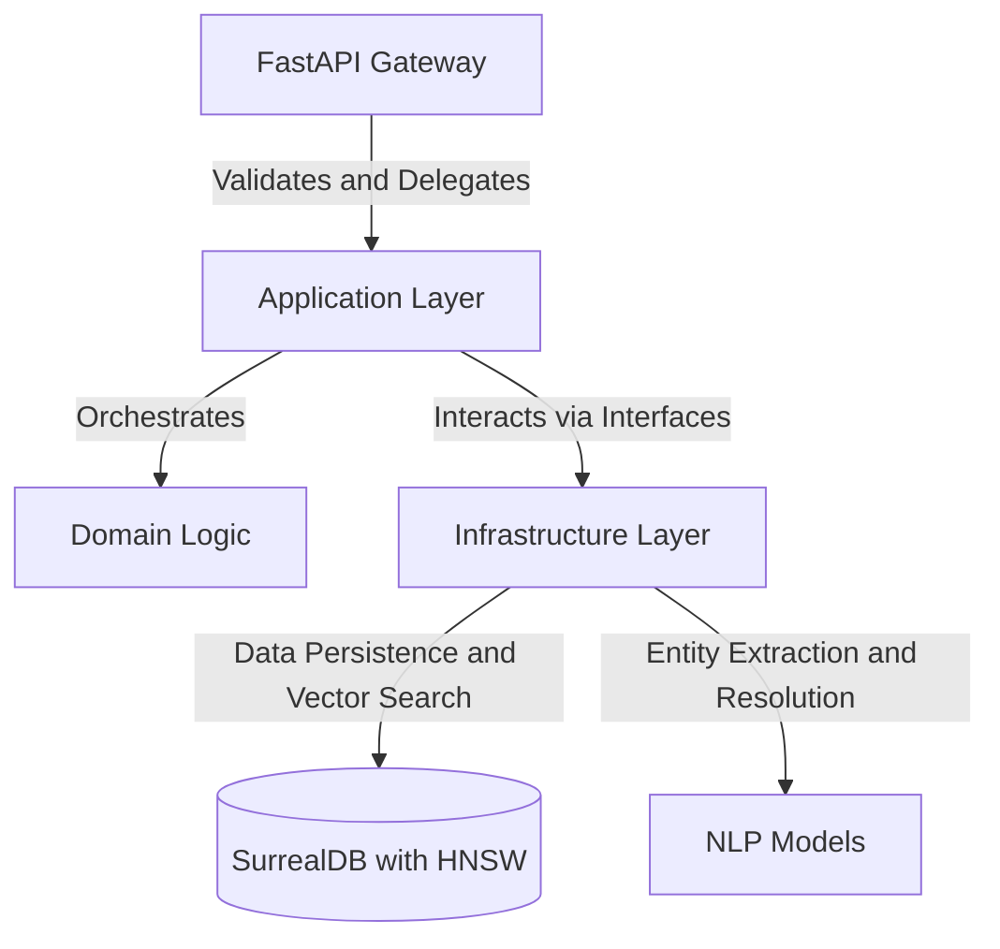

# Architecture

The architecture of the Enterprise Omni-Copilot represents a sophisticated synthesis of modern data processing paradigms, unified under a rigorous Hexagonal Architecture. This structural philosophy, also known as the Ports and Adapters pattern, strictly isolates the core business logic from the volatile external dependencies of databases, user interfaces, and third-party models. By defining explicit contractual interfaces, the system guarantees that the intricate logic governing knowledge extraction and retrieval remains pristine and universally testable. This decoupling empowers the engineering team to swap out underlying technologies, such as transitioning between local embedding models and cloud-based inferential engines, without inducing cascading failures throughout the application codebase.

The entry point for all interactions within this ecosystem is managed by a high-performance, asynchronous gateway powered by FastAPI. This application programming interface layer is responsible for receiving varied forms of unstructured documents and complex user queries, validating the inbound payloads against strict schemas before delegating the tasks deeper into the system. It acts as a resilient shield, absorbing concurrent traffic spikes and ensuring that only well-formed data enters the processing pipeline. By abstracting the network protocols and serialization concerns, the gateway allows the subsequent layers to focus entirely on the profound work of semantic orchestration.

Beneath the protective shield of the gateway, the application layer orchestrates the complex choreography of the system's use cases. This layer coordinates the journey of a document through a series of intelligent transformations, managing the handoffs between chunking algorithms, coreference resolution engines, and the ultimate graph extraction pipelines. It dictates the high-level flow of data, ensuring that the theoretical intent of the GraphRAG paradigm is executed with precise programmatic sequence. Furthermore, this layer heavily leverages asynchronous programming primitives to manage the inherently high latency of natural language processing tasks, ensuring that the system remains highly responsive even when executing computationally expensive multi-hop traversals across the knowledge graph.

The foundational bedrock of this architecture is provided by a multi-model database engine, specifically SurrogateDB, equipped with Hierarchical Navigable Small World vector indexing capabilities. This infrastructural layer transcends the limitations of traditional relational stores by naturally representing the complex, multi-dimensional reality of the ingested data. It allows the system to instantaneously recall semantically related textual chunks via mathematical distance metrics while simultaneously mapping the profound topological connections between abstracted entities. This convergence of vector mathematics and graph theory within a single persistent store is the critical enabler of the system's ability to reason across vast troves of unstructured enterprise knowledge.

