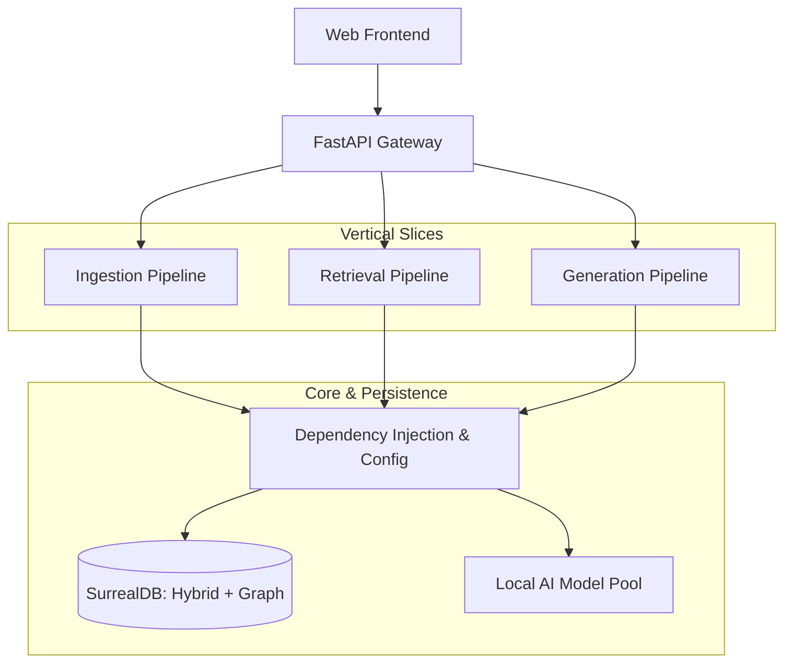

# Chapter 1: System Architecture

The architecture of CodaCite represents a paradigm shift from traditional layered models toward a **Vertical Slice Architecture**. While the system previously utilized a Hexagonal structure, the increasing complexity of AI pipelines necessitated a transition to a more feature-oriented organization. This "Modular Monolith" approach ensures that each functional slice—Ingestion, Retrieval, Generation—contains its own business logic, domain models, and infrastructure adapters, minimizing cross-component friction and accelerating the development of specialized AI capabilities.

## 1.1 The Vertical Slice Philosophy

In a traditional N-tier architecture, a single change often requires modifications across multiple layers (UI, Service, Repository). In CodaCite's Vertical Slice model, we organize code by **feature** rather than by technical role.

Key principles include:

* **Feature Autonomy**: Each pipeline (e.g., `app/pipelines/ingestion`) is a self-contained unit of work.
* **Contract-First Design**: Internal components communicate via explicit Python Protocols (Ports), allowing for seamless mocking and testing.
* **Reduced Abstraction Tax**: By grouping related logic, we avoid "spaghetti layers" where simple tasks are buried under multiple levels of indirection.

## 1.2 The Dependency Injection Core

At the heart of the system is a robust **Dependency Injection (DI)** framework. This ensures that heavy resources, such as LLMs and vector embedding models, are managed as singletons and injected precisely where needed. This is critical for:

* **Resource Efficiency**: Preventing redundant loading of multi-gigabyte transformer models.
* **Testability**: Allowing unit tests to inject `AsyncMock` providers instead of live model instances.
* **Operational Flexibility**: Enabling a single configuration toggle to switch between a local `Ollama` generator and a cloud-based `Gemini` API.

## 1.3 Strategic Data Partitioning: The Notebook Model

CodaCite introduces the **Multi-Notebook Orchestration** model as a primary mechanism for managing cognitive load. Rather than operating on a monolithic document store, the system utilizes graph-based relations to dynamically filter context:

1. **Logical Isolation**: Users partition data into "Notebooks".
2. **Graph-Enforced Scoping**: When a retrieval query is issued, SurrealDB filters the search space using `belongs_to` relationships between documents and the active notebook set.
3. **Low-Latency Toggling**: Because scoping is enforced at the database query level, switching between context sets in the UI is instantaneous.

## 1.4 Architectural Schematic


```mermaid
graph TD
    UI[Web Frontend]
    API[FastAPI Gateway]

    subgraph "Vertical Slices"
        INGEST[Ingestion Pipeline]
        RETR[Retrieval Pipeline]
        GEN[Generation Pipeline]
    end

    subgraph "Core & Persistence"
        CORE[Dependency Injection & Config]
        DB[(SurrealDB: Hybrid + Graph)]
        MODELS[Local AI Model Pool]
    end

    UI --> API
    API --> INGEST
    API --> RETR
    API --> GEN

    INGEST --> CORE
    RETR --> CORE
    GEN --> CORE

    CORE --> DB
    CORE --> MODELS
```

---

> [!TIP]
> Architects should focus on the `app/pipelines` directory as the primary location for business logic evolution. Each subdirectory represents a discrete capability of the CodaCite brain.
```
