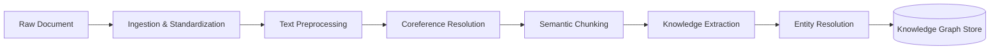

# Data Pipeline

The journey of any given piece of unstructured data commences at the ingestion and preprocessing lifecycle, a critical phase dedicated to standardizing chaotic information into a precise analytical format. The document loader acts as the initial conduit, parsing disparate file types, including complex portable document formats and markdown structures, into a unified internal representation. Subsequently, the text preprocessor undertakes rigorous normalization routines, resolving anomalous Unicode characters and systematically compressing errant whitespace. This foundational sanitization ensures that the underlying semantic integrity of the document is preserved against the idiosyncrasies of human formatting. Before the standardized text is subjected to the chunking strategy, it undergoes a vital linguistic transformation through coreference resolution. Powered by specialized libraries such as `fastcoref`, this step analyzes the grammatical structure to unify disparate pronoun and noun mentions back to their primary entities. By resolving these references across the continuum of the text, the system guarantees that the contextual weight of an entity is completely captured, preventing semantic fragmentation when the document is ultimately partitioned into analytical chunks.

Once the preprocessing algorithms have refined the text, the resulting semantic chunks are propelled into the knowledge graph extraction pipeline. Here, the system orchestrates a profound transition from linear text to a multidimensional, structured knowledge representation. Utilizing the immense inferential capabilities of foundational language models like Google Gemini, or seamlessly falling back to local extraction networks like GLiNER for disconnected or highly secure environments, the pipeline meticulously identifies semantic nodes and relational edges. The algorithms parse the syntactic dependencies within each chunk, isolating actors, actions, and objects, and mapping them into a structured triad format suitable for advanced graph storage.

Recognizing the inherent ambiguity and variability in natural language, the system employs advanced resolution techniques to prevent the proliferation of duplicate entities. A specialized resolver component, utilizing algorithms like the Jaro-Winkler distance, calculates complex string similarities and evaluates corresponding high-dimensional vector embeddings to determine if newly extracted nodes refer to existing concepts within the graph. This meticulous reconciliation process is imperative to maintaining a coherent and singular source of truth within the database. By continuously collapsing synonymous entities and merging their relational edges, the data pipeline ensures that the knowledge graph matures into a dense, highly connected web of intelligence rather than a fragmented collection of redundant, disconnected nodes.

## Observability and Instrumentation

To facilitate granular monitoring of the complex ingestion lifecycle, the data pipeline is instrumented with a comprehensive observability framework. Every document transition—from initial upload and chunking to coreference resolution and final graph insertion—is meticulously tracked using structured `[INGEST]` logging tags. This telemetry allows operators to pinpoint bottlenecks or failures in real-time, providing immediate visibility into the state of any given document within the processing queue. By surface-leveling these internal metrics, the system ensures that the document intelligence pipeline remains transparent and maintainable, even as the volume of ingested data scales into the millions of entities.

