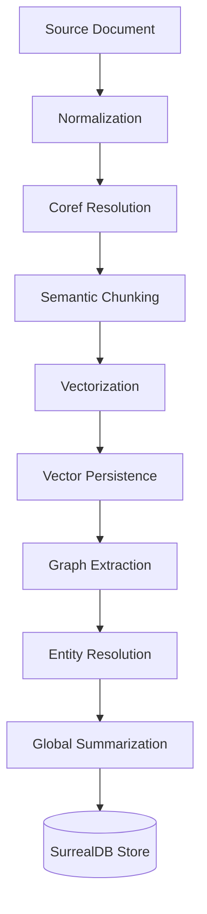

# Chapter 2: The Data Ingestion Lifecycle

The transformation of unstructured, chaotic data into a mathematically precise Knowledge Graph is the most computationally intensive journey within the CodaCite ecosystem. This chapter details the **9-Phase Ingestion Pipeline**, a sequential orchestration of linguistic analysis, semantic partitioning, and graph synthesis.

## 2.1 Theoretical Foundation: Semantic Partitioning

CodaCite transforms raw, unstructured PDF documents into a structured Knowledge Graph through a meticulous multi-phase pipeline that prioritizes semantic coherence over arbitrary character limits:

1. **High-Fidelity Extraction**: Utilizing `Docling` or `RapidOCR` to recover text while preserving layout, tables, and reading order.
2. **Linguistic Normalization**: Resolving pronouns and ambiguous references to ensure entities are correctly identified across chunks.
3. **Atomic Semantic Chunking**: Breaking text into units that contain a single, complete thought, enriched with document-level metadata.
4. **Graph-Vector Synthesis**: Simultaneously generating dense embeddings for retrieval and extracting logical relationships for the Knowledge Graph.

This dual-path approach ensures that every chunk is not just a vector in space, but a node in a meaningful network of evidence.

## 2.2 The 9-Phase Transformation

### Phase 1: High-Fidelity Extraction (VRAM-Aware)

The document loader extracts text from disparate sources (PDF, Markdown, HTML). For complex PDFs, CodaCite utilizes a dynamic **VRAM-Aware routing mechanism**:

- **GPU (CUDA/MPS)**: If > 1.5GB VRAM is available, `Docling` offloads OCR and layout analysis to the hardware accelerator for 5-10x speedups.
- **CPU Fallback**: If memory is constrained, the system safely falls back to CPU-only extraction using `RapidOCR` or `PyMuPDF` to prevent OOM (Out-of-Memory) crashes.

All text is normalized to **Unicode NFKC** format to resolve anomalous character encodings.

### Phase 2: Coreference Resolution

Using the `FastCoref` engine, the system resolves ambiguous pronouns ("it", "they", "this company") back to their primary entities. This "linguistic normalization" is critical for ensuring that graph extraction (Phase 6) correctly identifies the actors involved in a statement.

### Phase 3: Structural Contextual Chunking

The document is partitioned into logically coherent fragments using the `StructuralContextChunker`. Unlike naive character-splitters, this chunker:

1. **Respects Boundaries**: Splits at paragraphs, headers, and semantic breaks.
2. **Preserves Provenance**: Meticulously tracks **`start_char`** and **`end_char`** offsets relative to the original source text.
3. **Injects Context**: Prepends parent headers and document titles to each chunk, ensuring individual vectors retain the "Global Narrative."

### Phase 4: Vectorization (Embedding)

Every chunk is processed through the `BGE-M3` transformer model to generate a **1024-dimensional dense vector**. These vectors are indexed using the HNSW algorithm in SurrealDB for near-instantaneous semantic retrieval.

### Phase 5: Vector Persistence

The generated embeddings and their associated chunk text are committed to SurrealDB's vector storage. This phase establishes the foundational retrieval layer.

### Phase 6: Knowledge Extraction (Stage 1 & 2)

The system invokes a hybrid extraction process:

- **Stage 1**: `GLiNER` (Zero-Shot NER) identifies entities (Nodes) with high precision and low latency.
- **Stage 2**: A high-reasoning LLM (`DeepSeek-R1` or `Gemini`) maps logical relationships (Edges) between the spotted entities.

### Phase 7: Semantic Blocking & Resolution

Newly extracted entities are reconciled against the global Knowledge Graph using a two-stage pipeline:

1. **Semantic Blocking**: Candidates are grouped using vector similarity to reduce the $O(n^2)$ comparison space.
2. **Cross-Encoder Verification**: A `ModernBERT` cross-encoder confirms matches with high confidence (>0.85) before nodes are merged.

### Phase 8: Global Document Summarization

Using a **Map-Reduce** strategy, the system synthesizes a high-level executive summary of the entire document. This summary is persisted to the document record and provides the foundation for "Global RAG" and rapid document previewing.

### Phase 9: Finalization & Indexing

The document status is updated to `active`. SurrealDB finalizes the indexing of both vector and graph structures, making the content immediately available for multi-notebook retrieval.

## 2.3 Data Provenance: The Evidence Chain

A core tenet of the CodaCite methodology is the **Evidence Chain**. By persisting character offsets at every stage of the pipeline, the system can generate responses that are not just "accurate," but "auditable."

When an LLM generates a response, it refers to a specific chunk ID. The system uses the persisted `start_char/end_char` to highlight the exact sentence in the original document, providing the user with absolute confidence in the AI's reasoning.

```mermaid
graph TD
    DOC[Source Document] --> NORM[Normalization]
    NORM --> COREF[Coref Resolution]
    COREF --> SEM[Semantic Chunking]
    SEM --> VEC[Vectorization]
    VEC --> VSTORE[Vector Persistence]
    VSTORE --> KG[Graph Extraction]
    KG --> RES[Entity Resolution]
    RES --> SUM[Global Summarization]
    SUM --> DB[(SurrealDB Store)]
```
