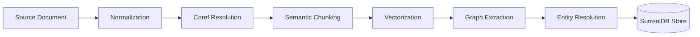

# Chapter 2: The Data Ingestion Lifecycle

The transformation of unstructured, chaotic data into a mathematically precise Knowledge Graph is the most computationally intensive journey within the CodaCite ecosystem. This chapter details the **8-Phase Ingestion Pipeline**, a sequential orchestration of linguistic analysis, semantic partitioning, and graph synthesis.

## 2.1 Theoretical Foundation: Semantic Partitioning

CodaCite transforms raw, unstructured PDF documents into a structured Knowledge Graph through a meticulous 8-phase pipeline:

1. **Text Extraction**: High-fidelity text recovery from PDFs, preserving layout and reading order.
2. **Semantic Chunking**: Breaking text into logically coherent units based on structural markers rather than arbitrary character counts.
3. **Coreference Resolution**: Replacing ambiguous pronouns (e.g., "it", "they") with their specific entities using `fastcoref`.
4. **Entity Extraction**: Identifying key actors, concepts, and locations using `GLiNER` (Zero-Shot NER).

This ensures that every chunk remains semantically coherent, preventing the "context fragmentation" that plagues traditional RAG systems.

## 2.2 The 8-Phase Transformation

### Phase 1: Normalization & Standardization
The document loader extracts text from disparate sources (PDF, Markdown, HTML). All text is normalized to **Unicode NFKC** format to resolve anomalous character encodings, and errant whitespace is compressed to ensure consistent tokenization.

### Phase 2: Coreference Resolution
Using the `FastCoref` engine, the system resolves ambiguous pronouns ("it", "they", "this company") back to their primary entities. This "linguistic normalization" is critical for ensuring that graph extraction (Phase 6) correctly identifies the actors involved in a statement.

### Phase 3: Semantic Partitioning (Chunking)
As detailed in section 2.1, the document is partitioned into coherent fragments. During this phase, CodaCite meticulously tracks the **`start_char`** and **`end_char`** offsets relative to the original source text. This provides the "Link of Evidence" required for high-fidelity citations.

### Phase 4: Persistence (Stage 1)
The raw chunks and their provenance metadata are committed to SurrealDB. This phase establishes the foundational relationships: `Document -> belongs_to -> Notebook` and `Document -> contains -> Chunk`.

### Phase 5: Vectorization (Embedding)
Every chunk is processed through the `BGE-M3` transformer model to generate a **1024-dimensional dense vector**. These vectors are indexed using the HNSW algorithm for near-instantaneous semantic retrieval.

### Phase 6: Knowledge Extraction
The system invokes a "Reasoning Agent" (Google Gemini or a local GLiNER fallback) to identify entities (Nodes) and relationships (Edges) within each chunk. Extraction is guided by strict Pydantic schemas to ensure data integrity.

### Phase 7: Entity Resolution & Deduplication
Newly extracted entities are reconciled against the global Knowledge Graph. The system employs **Jaro-Winkler string similarity** and **vector distance** to determine if "DeepMind" and "Google DeepMind" refer to the same entity. If a match is found, the nodes are merged and their relational edges are collapsed.

### Phase 8: Finalization
The document status is updated to `active`. SurrealDB triggers an asynchronous rebuild of the HNSW index to incorporate the new vectors, making the document immediately available for retrieval.

## 2.3 Data Provenance: The Evidence Chain

A core tenet of the CodaCite methodology is the **Evidence Chain**. By persisting character offsets at every stage of the pipeline, the system can generate responses that are not just "accurate," but "auditable."

When an LLM generates a response, it refers to a specific chunk ID. The system uses the persisted `start_char/end_char` to highlight the exact sentence in the original document, providing the user with absolute confidence in the AI's reasoning.

```mermaid
graph LR
    DOC[Source Document] --> NORM[Normalization]
    NORM --> COREF[Coref Resolution]
    COREF --> SEM[Semantic Chunking]
    SEM --> VEC[Vectorization]
    VEC --> KG[Graph Extraction]
    KG --> RES[Entity Resolution]
    RES --> DB[(SurrealDB Store)]
```
