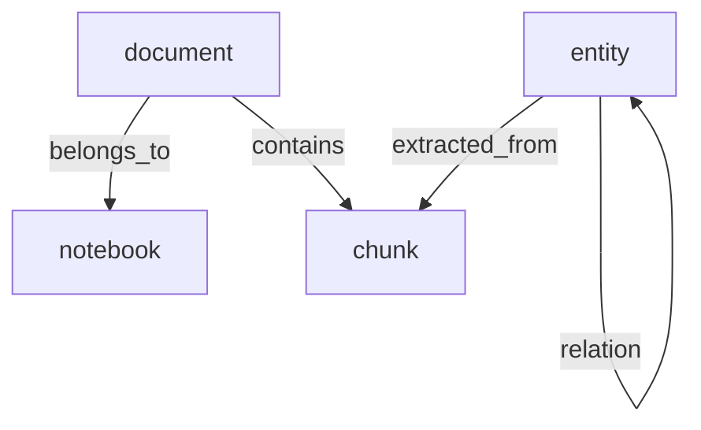

# Infrastructure

At the core of this expansive architecture lies the foundational role of SurrealDB, selected explicitly for its unparalleled versatility as a primary storage engine. Embracing a multi-model paradigm, the database seamlessly and simultaneously acts as a highly scalable document store for the meticulously processed text chunks and as a native graph database capable of traversing complex relationships. This dual capability eliminates the impedance mismatch typically encountered when synchronizing separate relational and graph systems. By unifying the storage layer, the application ensures that the textual representation of a chunk and its corresponding graph topology are maintained in absolute synchrony, guaranteeing data integrity and transactional consistency across the entire intelligence lifecycle.

The infrastructure heavily leverages the implementation of Hierarchical Navigable Small World indices, specifically configured as MTREE structures within the SurrealDB environment. These advanced indices facilitate highly optimized cosine distance searches across vast high-dimensional vector spaces. When the application generates dense embeddings representing the semantic meaning of text chunks or entity descriptions, these vectors are inserted into the index, allowing the system to achieve extraordinary performance when retrieving semantically similar content. This mathematical optimization is crucial for anchoring the system's massive throughput capabilities, ensuring that complex similarity calculations do not become a computational bottleneck during real-time user interactions or concurrent batch processing.

Beyond the real-time operational demands, the infrastructure supports continuous, asynchronous refinement processes such as graph enhancement and community detection. Operating in the background, these refinement pipelines analyze the ever-expanding knowledge graph to deduce macro-level structural patterns. By employing advanced community detection algorithms, such as the Louvain method via the NetworkX library, the system algorithmically identifies dense clusters and thematic groupings of nodes that share intense relational gravity. The discovery of these underlying communities enables the application to transcend micro-level facts, allowing the generative language model to synthesize holistic insights and panoramic overviews of the entire knowledge base based on the structural topology of the data itself.

## Data Consistency and Type Harmonization

To maintain the rigorous standards of the internal Pydantic domain models, the infrastructure implements a critical type-harmonization layer between the application and the SurrealDB storage engine. SurrealDB utilizes specialized `RecordID` objects for referencing data, which inherently contain database-specific prefixes (e.g., `chunk:`, `entity:`). To ensure seamless compatibility with strict-mode validation, the application's storage adapters (`SurrealDocumentStore` and `SurrealGraphStore`) automatically sanitize these identifiers during retrieval. This process casts complex database types into pure string representations and strips prefixes, ensuring that the domain logic remains isolated from database-level implementation details while preserving the integrity of the unique identifier across the entire system.

The infrastructure is designed for high resilience in diverse hardware environments through an adaptive resource allocation strategy. Recognizing the significant memory overhead of modern machine learning models, the application strictly respects a system-level `DEVICE` configuration. Components such as the `HuggingFaceEmbedder`, `GLiNERFallbackExtractor`, and `FastCorefResolver` are instrumented to prioritize this setting, enabling a graceful fallback to CPU-based inference when GPU resources are constrained or unavailable. This strategy prevents critical `CUDA Out of Memory` failures, ensuring that the document intelligence pipeline remains operational even on commodity hardware or within shared containerized environments. By default, the system leverages **OpenVINO** for accelerated CPU inference on Intel-compatible architectures.

## Secure Secret Management

To eliminate the risks associated with hardcoded credentials and manual environment variable management, the infrastructure integrates directly with the system's **Secret Service** (libsecret). This is particularly optimized for development environments using **KeePassXC**.

The application configuration layer automatically attempts to resolve the Gemini API key from the local secret store using the following parameters:

- **Label/Title**: `Gemini_API`

This integration utilizes the `secretstorage` library to communicate directly with the D-Bus secret service, ensuring that sensitive keys remain encrypted at rest and are only accessed in-memory during application startup. If a key is explicitly provided via the `GEMINI_API_KEY` environment variable, it will always take precedence over the secret store, allowing for flexible deployment across both local and production environments.

## Database Schema

CodaCite utilizes SurrealDB's multi-model capabilities to store both relational metadata and graph-based semantic links.

### Table Definitions

| Table | Type | Description |
| :--- | :--- | :--- |
| `notebook` | SCHEMAFULL | Logical container for projects. |
| `document` | SCHEMAFULL | Metadata for ingested files (PDF/MD). |
| `belongs_to` | RELATION | Edge from `document` to `notebook`. |
| `chunk` | SCHEMAFULL | Text fragments with HNSW vector index. |
| `contains` | RELATION | Edge from `document` to `chunk`. |
| `entity` | SCHEMAFULL | Extracted KG nodes with description embeddings. |
| `extracted_from` | RELATION | Edge from `entity` to its source `chunk`. |
| `relation` | RELATION | Semantic edge between two `entity` nodes. |

## Automated Maintenance and Index Health

To ensure long-term performance and data integrity within the SurrealDB HNSW vector index, the infrastructure implements **Automated Maintenance Loops**. Vector indices can suffer from performance degradation due to "tombstones" (logical deletions).

The `SurrealDocumentStore` tracks a global deletion counter in the `maintenance` table. Every 5 document deletions, the system automatically triggers:

1.  **Index Rebuilding**: Executes `REBUILD INDEX chunk_embedding_idx ON TABLE chunk`.
2.  **Tombstone Purging**: Rebuilding physically removes deleted vectors and re-optimizes the navigable HNSW graph.
3.  **Graph Integrity**: Relational edges (`belongs_to`, `contains`, `extracted_from`) are transactionally removed via `DEFINE EVENT` triggers to prevent dangling relations.

## Query Splitting for Batch Persistence

A critical technical constraint was identified when interfacing with **SurrealDB v1.5.4** regarding multi-statement string queries. Specifically, the database parser often fails to correctly identify the termination of a `RELATE` statement when combined with subsequent `UPDATE` or `INSERT` operations in a single string, even when separated by semicolons.

To guarantee transactional reliability, the infrastructure layer implements a **Query Splitting Strategy**:
- **Atomic Operations**: Operations like `save_chunks` and `save_nodes` are split into distinct, sequential asynchronous calls.
- **Relational Integrity**: Relations are established after the records themselves have been successfully persisted, preventing "Record not found" errors during complex graph linking.
- **RecordID Harmonization**: All queries explicitly use the `type::thing($table, $id)` cast to ensure consistent parsing of SurrealDB's internal `RecordID` format across different driver versions.

## OpenVINO Optimized Embeddings

To achieve high-performance inference on CPU-bound environments, the `HuggingFaceEmbedder` utilizes the **OpenVINO (Intel Open Visual Inference and Neural network Optimization)** toolkit.

- **Quantization**: Models are dynamically quantized to 8-bit integers (INT8) where supported, significantly reducing memory footprint and increasing throughput without substantial loss in semantic accuracy.
- **Fallback Logic**: If the system environment does not support OpenVINO (e.g., non-x86 architectures or missing libraries), the embedder gracefully falls back to a standard PyTorch implementation with dynamic quantization enabled.
- **Model Isolation**: Embedding models are cached locally in the `.cache/huggingface` directory to avoid redundant downloads and ensure offline operation capability.

## The 8-Phase Ingestion Pipeline

The document intelligence process is structured as a rigorous 8-phase asynchronous pipeline, ensuring that every document is thoroughly decomposed and semantically mapped before becoming searchable:

1. **Phase 1: Loading & Preprocessing**: File validation, text extraction (PDF/Text), and NFKC normalization.
2. **Phase 2: Coreference Resolution**: Resolving pronoun ambiguities (e.g., "he," "it") to their original entities using `fastcoref`.
3. **Phase 3: Chunking**: Recursive character-based splitting with semantic overlap via LangChain.
4. **Phase 4: Document Persistence**: Saving raw chunks and establishing `belongs_to` notebook relations in SurrealDB.
5. **Phase 5: Vectorization (Embedding)**: Generating 1024D vectors for semantic search using BGE-M3 (OpenVINO optimized).
6. **Phase 6: Knowledge Extraction**: Discovery of entity nodes and relationship edges from text chunks using Gemini (or GLiNER).
7. **Phase 7: Entity Resolution**: Merging duplicate entities using Jaro-Winkler similarity and vector distance.
8. **Phase 8: Finalization**: Updating document status to `active` and triggering vector index maintenance.
