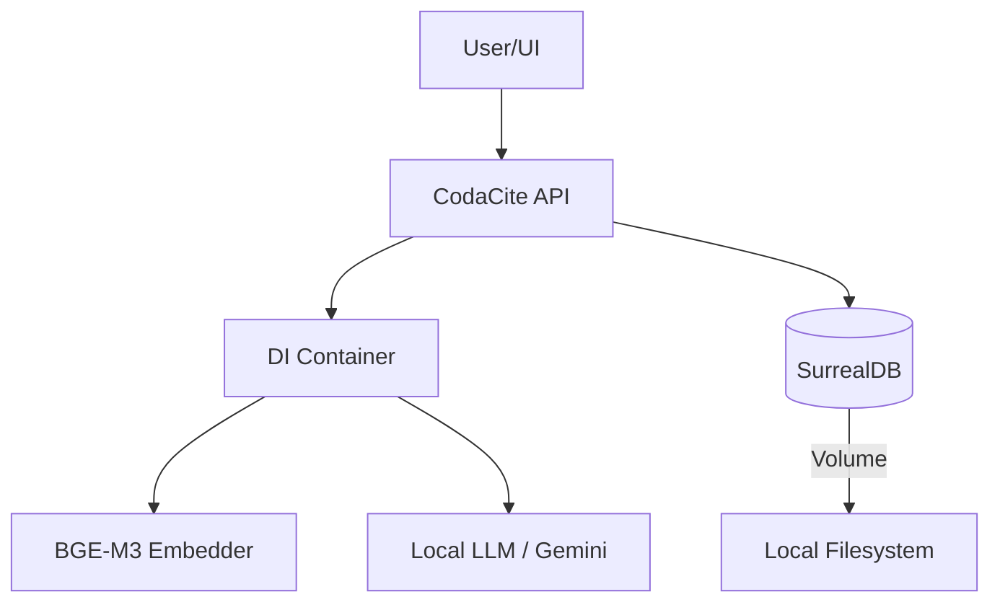

# Chapter 4: System Infrastructure & Persistence

The resilience of the CodaCite engine is predicated on its underlying infrastructure—a "local-first" design that prioritizes data sovereignty and high-performance inference. The system utilizes a multi-modal model stack to handle the transition from raw document bytes to a searchable Knowledge Graph:

* **Text/Layout**: `Docling` (for semantic structure recovery).
* **Embeddings**: `BGE-M3` (1024D, multi-lingual, cross-modal).
* **Extraction**: `GLiNER` (Zero-shot Named Entity Recognition).

## 4.2 Database: SurrealDB 3.0.5

CodaCite leverages SurrealDB as a **Multi-Model Database**. It serves as a:

1. **Document Store**: Storing raw markdown and JSON metadata.
2. **Vector Store**: Performing HNSW-based similarity searches on 1024D embeddings.
3. **Graph Database**: Managing complex relationships (`mentions`, `belongs_to`, `extracted_from`) between entities and chunks.

### Performance Tuning: The HNSW Index
To ensure sub-100ms retrieval latency across millions of chunks, we apply specific tuning to the SurrealDB vector index:

* **M (Max Connections)**: Tuned to 16 for optimal graph connectivity.
* **Ef_Construction**: Set to 128 to balance index speed and recall precision.

```surrealql
-- Example: Semantic search only within a specific notebook's graph neighborhood
SELECT *, vector::similarity::cosine(embedding, $query_vector) AS score
FROM chunk
WHERE (->belongs_to->notebook.id CONTAINS $notebook_id)
  AND embedding <1024, HNSW> $query_vector
ORDER BY score DESC;
```

## 4.2 Local-First Inference Architecture

CodaCite is designed to operate entirely on consumer-grade hardware. This is achieved through aggressive optimization and quantization of the underlying models.

### Model Quantization
To fit large transformer models into local VRAM/RAM, we employ **4-bit and 8-bit quantization** (GGUF/EXL2 formats):

*   **Embeddings**: `BGE-M3` is optimized via OpenVINO for rapid CPU/GPU inference.
*   **Reasoning**: Local extraction and reranking utilize small, high-density models like `ModernBERT` or `GLiNER`, ensuring the system remains responsive even without a dedicated A100 GPU.

### Dependency Injection (DI) & Lifecycle
The infrastructure layer is managed via a strict **Dependency Injection** pattern (using `FastAPI` dependencies). This ensures that heavy model artifacts are:

1.  **Lazy-Loaded**: Models are only initialized when the first request arrives.
2.  **Singletons**: A single instance of a model is shared across all threads to prevent OOM (Out of Memory) crashes.
3.  **Scoped**: Resources are cleanly released when the application shuts down.

## 4.3 Containerization: Podman Orchestration

For development and deployment, CodaCite utilizes **Podman** and **Podman-Compose**. Unlike Docker, Podman is "rootless" and "daemonless," offering a more secure and lightweight environment for local data processing.

The orchestration defines two primary services:

*   **`surrealdb`**: The persistent storage engine, mounted to a local volume.
*   **`api`**: The Python-based intelligence engine, containing the ingestion and retrieval pipelines.


```mermaid
graph TD
    USER[User/UI] --> API[CodaCite API]
    API --> DI[DI Container]
    DI --> EMBED[BGE-M3 Embedder]
    DI --> LLM[Local LLM / Gemini]
    API --> DB[(SurrealDB)]
    DB -- "Volume" --> DISK[Local Filesystem]
```
