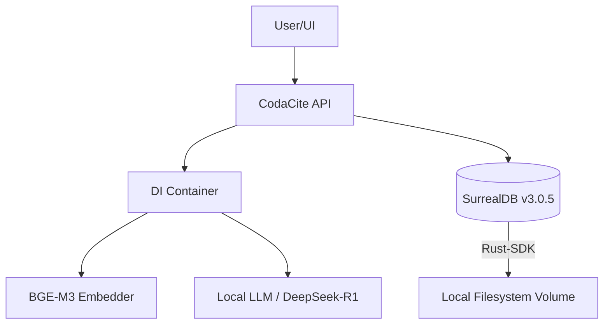

# Chapter 4: System Infrastructure & Persistence

The resilience of the CodaCite engine is predicated on its underlying infrastructure—a "local-first" design that prioritizes data sovereignty and high-performance inference. The system utilizes a multi-modal model stack to handle the transition from raw document bytes to a searchable Knowledge Graph:

* **Text/Layout**: `Docling` (for semantic structure recovery).

* **Embeddings**: `BGE-M3` (1024D, multi-lingual, cross-modal).

* **Extraction**: `GLiNER` (Zero-shot Named Entity Recognition).

## 4.1 Database: SurrealDB 3.0.5

CodaCite leverages SurrealDB as a **Multi-Model Database**, utilizing the modern **Rust-based Python SDK** for high-performance, asynchronous communication. It serves as a unified storage layer for:

1. **Document Store**: Persisting raw markdown, semantic chunks, and JSON metadata.

2. **Vector Store**: Performing HNSW-based similarity searches on 1024D embeddings.

3. **Graph Database**: Managing complex semantic relationships (`mentions`, `belongs_to`, `extracted_from`) between entities and chunks.

### The Hybrid Scoring Mechanism

To maximize retrieval precision, CodaCite implements a **Hybrid HNSW + BM25 Search** logic. This ensures that both semantic context and exact keyword matches (e.g., technical terms, proper names) are weighted correctly.

```surrealql
-- Example: Hybrid search with graph scoping
SELECT *,
  (vector::similarity::cosine(embedding, $query_vector) * 0.7) +
  (search::score(1) * 0.3) AS score
FROM chunk
WHERE (->belongs_to->notebook.id CONTAINS $notebook_id)
  AND (embedding <1024, HNSW> $query_vector OR text @1@ $query_text)
ORDER BY score DESC;
```

### Performance Tuning: The HNSW Index

To ensure sub-100ms retrieval latency across millions of chunks, the following parameters are applied to the SurrealDB vector index:

* **M (Max Connections)**: 16 (Optimal for high-dimensional graph connectivity).

* **Ef_Construction**: 128 (Balances index speed and recall precision).

* **Distance Metric**: `Cosine` (Ideal for BGE-M3 unit-normalized embeddings).

## 4.2 Local-First Inference Architecture

CodaCite is designed to operate entirely on consumer-grade hardware through aggressive optimization and quantization of the underlying model stack.

### Model Quantization & Acceleration

To fit large transformer models into local memory, we employ multi-backend quantization strategies:

* **Embeddings**: `BGE-M3` is optimized via **OpenVINO** for near-native CPU/GPU performance on Intel/AMD hardware.

* **Reasoning**: Local extraction utilizes **GGUF** (4-bit/8-bit) via `llama.cpp` or **EXL2** for high-throughput GPU inference.

* **Reranking**: `ModernBERT` is utilized for cross-attention scoring, providing high-precision ranking at a fraction of the cost of full LLM inference.

### Dependency Injection (DI) & Lifecycle

The infrastructure layer is managed via a strict **Dependency Injection** pattern (using `FastAPI` dependencies). This ensures that heavy model artifacts are:

1. **Lazy-Loaded**: Models are only initialized when the first request arrives, reducing startup cold-starts.

2. **Thread-Safe Singletons**: A single instance of a model is shared across the entire application process to prevent OOM crashes.

3. **Scoped**: Resources are cleanly released during the `lifespan` shutdown event.

## 4.3 Containerization: Podman Orchestration

For development and deployment, CodaCite utilizes **Podman** and **Podman-Compose**. Unlike Docker, Podman is "rootless" and "daemonless," offering a more secure and lightweight environment for local data processing.

The orchestration defines two primary services:

* **`surrealdb`**: The persistent storage engine, utilizing the `surrealdb/surrealdb:v3.0.5` image with local volume persistence.

* **`api`**: The Python 3.13-based intelligence engine, built using the `uv` package manager for ultra-fast dependency resolution.


```mermaid
graph TD
    USER[User/UI] --> API[CodaCite API]
    API --> DI[DI Container]
    DI --> EMBED[BGE-M3 Embedder]
    DI --> LLM[Local LLM / DeepSeek-R1]
    API --> DB[(SurrealDB v3.0.5)]
    DB -- "Rust-SDK" --> DISK[Local Filesystem Volume]
```
