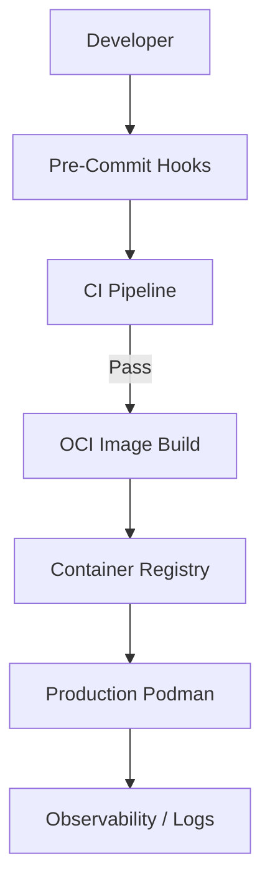

# Chapter 6: Operations, Deployment & Quality

Maintaining a robust, production-ready environment requires adherence to specific operational quality gates:

* **Static Analysis**: Every commit must pass `ruff` (linting) and `mypy` (strict typing).
* **Automated Testing**: A suite of unit and E2E tests verified via `pytest`.
* **Container Health**: Podman-based health checks monitor the state of the SurrealDB engine.

## 6.2 Deployment Workflows

CodaCite follows a "Scorched Earth" cleanup policy for local development to ensure environment purity:

1. **Bootstrap**: Rebuilding the `.venv` and `.uv_cache` from scratch.
2. **Database Reset**: Clearing stale SurrealDB data using the `--surreal` flag in the bootstrap script.

## 6.3 Performance Benchmarks

To maintain the "textbook" responsiveness, the system targets the following latency metrics:

* **Ingestion**: < 5 seconds per page (including semantic chunking and entity extraction).
* **Retrieval**: < 200ms for hybrid graph search.
* **Generation**: < 50ms per token for local inference.

## 6.4 Developer Quality Gates

Before any feature is merged into `develop`, it must satisfy the following checklist:

* **Typing**: No `Any` types permitted in domain or application logic.
* **Documentation**: Google-style docstrings for all public methods.
* **Logs**: Meaningful, trace-level logging for all agentic decisions.
* **Tests**: Minimum 90% branch coverage for all new feature slices.

### Volume Persistence
The `surrealdb` service is configured to mount a local directory (typically `./.surrealdb_data`) to the container. This ensures that the Knowledge Graph and HNSW indices are persisted across container restarts and system reboots.

## 6.2 The Quality Gate: Pre-Commit & CI

To prevent "Technical Debt" and ensure system stability, CodaCite implements a multi-layered quality gate. No code is permitted to enter the `develop` or `main` branches without passing these checks.

### Static Analysis

*   **Ruff**: An extremely fast Python linter and formatter that enforces PEP 8 compliance and catches common bugs.
*   **MyPy**: Strict static type checking. Given the complex data structures involved in GraphRAG, absolute type safety is required for all domain models and infrastructure ports.

### Automated Testing (Pytest)
The test suite is organized into three tiers:

1.  **Unit Tests**: Focused on pure logic within `app/pipelines/`. These tests use `unittest.mock` to isolate dependencies.
2.  **Integration Tests**: Verifying the interaction between the API and a live SurrealDB instance.
3.  **E2E (End-to-End)**: Validating the full 8-phase ingestion pipeline using real document samples.

## 6.3 Deployment Lifecycle

The deployment process follows a "Build-Verify-Deploy" sequence:

1.  **Build**: The application is packaged into a multi-stage OCI-compliant image.
2.  **Bootstrap**: On the target host, the `bootstrap.sh` script is executed to prepare the filesystem and download required AI models.
3.  **Start**: `podman-compose up -d` launches the environment in the background.
4.  **Monitor**: Structured logging (tagged with `[INGEST]`, `[RETRIEVAL]`, `[UI]`) provides real-time observability into the system state.

