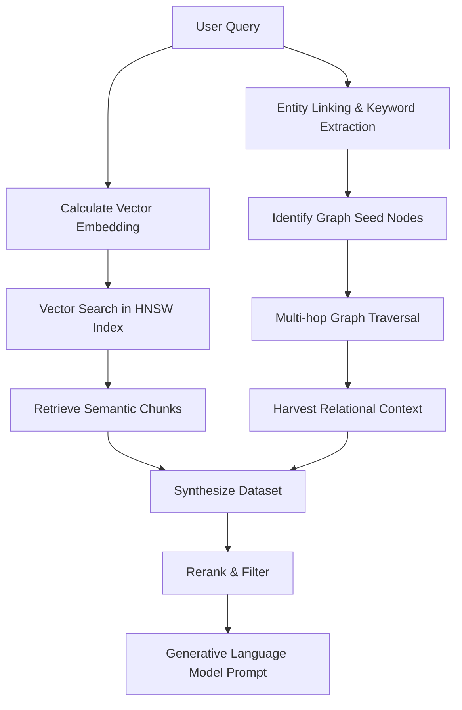

# Retrieval

Retrieval within the Enterprise Omni-Copilot transcends conventional methodologies through an advanced hybrid mechanism, commonly designated as Graph-based Retrieval-Augmented Generation. This retrieval pipeline is ingeniously constructed to overcome the inherent limitations of simple vector search, which often fails to capture the broader, interconnected context of a nuanced query. When a user submits an inquiry, the system immediately calculates its dense vector embedding. This embedding is used to interrogate advanced indexing structures, specifically Hierarchical Navigable Small World MTREE indices located within the SurrealDB instance, to rapidly isolate the most semantically relevant text chunks from the vast storage repository. This initial vector proximity search provides a foundational layer of explicitly stated facts relevant to the user's prompt by utilizing highly optimized cosine distance evaluations.

Simultaneously, a parallel process of entity linking dissects the user's query to identify critical concepts and map them to explicit seed nodes within the graph database. Initiating a multi-hop traversal from these identified seed nodes, the system explores the topological structure of the graph to a defined depth, typically executing graph queries that traverse outgoing and incoming edge relationships. This traversal harvests a rich, relational context that vector proximity alone cannot surface, traversing the edges to discover implicitly connected entities and the specific semantic nature of their relationships. By walking the graph, the system uncovers the surrounding logical framework of the initial concepts, gathering a constellation of related knowledge that provides profound contextual depth and historical lineage to the extracted facts.

The culmination of this hybrid retrieval process merges the deep semantic chunks identified via vector search with the structured relational context harvested from the graph traversal. Because this combined dataset can be expansive, logically disparate, and potentially noisy, it is passed through a sophisticated reranking mechanism. The reranker evaluates the synthesized context against the original query, algorithmically ordering the information to ensure that the most logically pertinent and factually dense fragments are prioritized at the top of the context window. This final orchestration guarantees that the generative language model is supplied with an unequivocally precise and highly curated prompt context, ensuring the highest fidelity, accuracy, and structural reasoning in the final synthesized response presented to the user.

## Retrieval Pipeline Stabilization

A fundamental prerequisite for reliable hybrid retrieval is the maintenance of unique identifier integrity across different storage modalities. The retrieval engine is optimized to utilize consistent string-based identifiers that link semantic chunks to their corresponding graph entities. By ensuring that every retrieved fragment—whether it originates from the HNSW vector index or the relational graph traversal—can be uniquely identified and mapped back to the source document, the system eliminates the risk of context misalignment. This stabilization ensures that the synthesized context provided to the language model is not only semantically relevant but also factually cohesive and topologically accurate.

