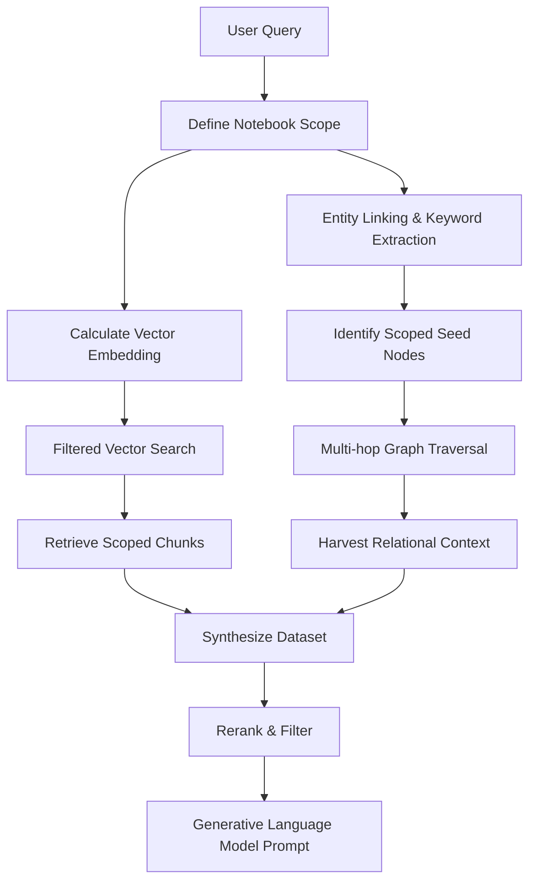

# Retrieval

Retrieval within CodaCite transcends conventional methodologies through an advanced hybrid mechanism, commonly designated as Graph-based Retrieval-Augmented Generation. This retrieval pipeline is ingeniously constructed to overcome the inherent limitations of simple vector search, which often fails to capture the broader, interconnected context of a nuanced query. 

## Notebook-Scoped Search

A major architectural pillar of CodaCite is the ability to perform **Notebook-Scoped Retrieval**. Instead of searching across the entire global database, the system allows users to select specific "Notebooks" to define the active context. 

When a query is issued, the retrieval engine applies a graph-based filter:
1. **Scope Definition**: The user provides a set of `notebook_ids`.
2. **Graph Filtering**: The system restricts both vector search and graph traversal to only those chunks and entities that are reachable through `belongs_to` relationships with the selected notebooks.
3. **Responsive Recalculation**: As users toggle notebooks in the UI, the active context is instantly updated, allowing for highly specific and relevant AI interactions.

## Hybrid Retrieval Pipeline

The retrieval pipeline executes two parallel processes:

1. **Vector Proximity Search**: The system calculates the dense vector embedding of the query and interrogates the SurrealDB HNSW indices to rapidly isolate the most semantically relevant text chunks within the active notebook scope.
2. **Relational Graph Traversal**: Simultaneously, an entity linking process identifies critical concepts and initiates multi-hop traversals within the knowledge graph. By walking the graph edges, the system discovers implicitly connected entities and relational context that provides historical lineage and logical depth.

The culmination of this hybrid retrieval process merges the deep semantic chunks identified via vector search with the structured relational context harvested from the graph traversal.

