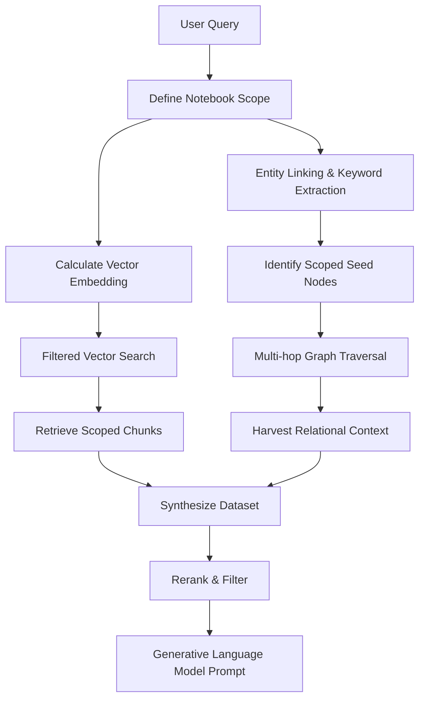

# Retrieval

Retrieval within CodaCite transcends conventional methodologies through an advanced hybrid mechanism, commonly designated as Graph-based Retrieval-Augmented Generation. This retrieval pipeline is ingeniously constructed to overcome the inherent limitations of simple vector search, which often fails to capture the broader, interconnected context of a nuanced query.

## Notebook-Scoped Search

A major architectural pillar of CodaCite is the ability to perform **Notebook-Scoped Retrieval**. Instead of searching across the entire global database, the system allows users to select specific "Notebooks" to define the active context.

When a query is issued, the retrieval engine applies a graph-based filter:

1. **Scope Definition**: The user provides a set of `notebook_ids`.
2. **Graph Filtering**: The system restricts both vector search and graph traversal to only those chunks and entities that are reachable through `belongs_to` relationships with the selected notebooks.
3. **Responsive Recalculation**: As users toggle notebooks in the UI, the active context is instantly updated, allowing for highly specific and relevant AI interactions.

The retrieval pipeline is orchestrated into five distinct stages, ensuring a robust and verifiable grounding for the generative response:

1. **Stage 1: Semantic Search**: The system calculates the query's dense vector embedding using the **BGE-M3** model and retrieves the top-k relevant text chunks from the **SurrealDB HNSW** index.
2. **Stage 2: Entity Linking**: Natural language terms in the query are mapped to specific seed nodes in the Knowledge Graph.
3. **Stage 3: Multi-Hop Graph Traversal**: Starting from seed nodes, the engine executes a breadth-first search (typically 2 hops) to identify related entities and semantic relations logically connected in the graph.
4. **Stage 4: Context Synthesis & Aggregation**: Text chunks, entity descriptions, and relationship triples are aggregated into a unified context packet, preserving source lineage for citation.
5. **Stage 5: Reranking**: (Optional) A specialized reranker evaluates the query against the combined context to prune irrelevant data and prioritize the most significant evidence.

The culmination of this hybrid retrieval process merges the deep semantic chunks identified via vector search with the structured relational context harvested from the graph traversal, providing a comprehensive "world model" for the query.

