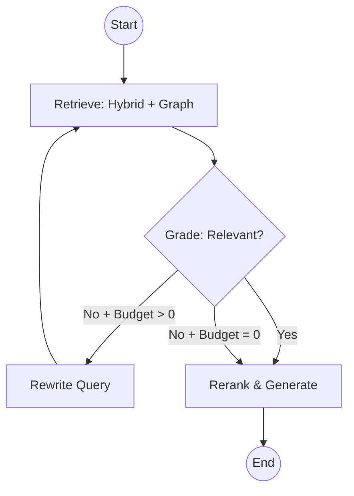

# Retrieval

Retrieval within CodaCite transcends conventional methodologies through an advanced hybrid mechanism, commonly designated as Graph-based Retrieval-Augmented Generation. This retrieval pipeline is ingeniously constructed to overcome the inherent limitations of simple vector search, which often fails to capture the broader, interconnected context of a nuanced query.

## Notebook-Scoped Search

A major architectural pillar of CodaCite is the ability to perform **Notebook-Scoped Retrieval**. Instead of searching across the entire global database, the system allows users to select specific "Notebooks" to define the active context.

When a query is issued, the retrieval engine applies a graph-based filter:

1. **Scope Definition**: The user provides a set of `notebook_ids`.
2. **Graph Filtering**: The system restricts both vector search and graph traversal to only those chunks and entities that are reachable through `belongs_to` relationships with the selected notebooks.
3. **Responsive Recalculation**: As users toggle notebooks in the UI, the active context is instantly updated, allowing for highly specific and relevant AI interactions.

The retrieval pipeline is orchestrated via a self-correcting **LangGraph** agentic loop, replacing the traditional linear flow with a cyclical Retrieve-Grade-Rewrite-Generate architecture. This ensures that only relevant context reaches the LLM and that ambiguous queries are automatically refined.

### 1. Hybrid Search (Phase 1)

Instead of pure vector search, CodaCite uses a **Hybrid BM25 + HNSW** mechanism in SurrealDB.

- **BM25 (Keyword)**: Captures exact matches for specific terminology, acronyms, or names.
- **HNSW (Semantic)**: Captures conceptual meaning using vector embeddings.
- **Scoring**: A weighted alpha parameter combines both scores: `score = (bm25 * α) + (cosine_sim * (1 - α))`.

### 2. Graph Context (Phase 2)

The engine performs **Entity Linking** and executes a multi-hop breadth-first search (typically 2 hops) to pull in structured relational context from the Knowledge Graph.

### 3. Agentic Grading & Self-Correction (Cycle)

The results are passed through a cyclical LangGraph loop:

1. **Retrieve**: Aggregates hybrid chunks and graph neighborhood.
2. **Grade**: A local LLM evaluates each context snippet for relevance. Irrelevant data is pruned.
3. **Rewrite (Optional)**: If zero relevant documents are found, the LLM rephrases the user's query to improve recall, and the loop repeats (up to 3 times).
4. **Generate**: The final, verified context is reranked and formatted for the generative prompt.

