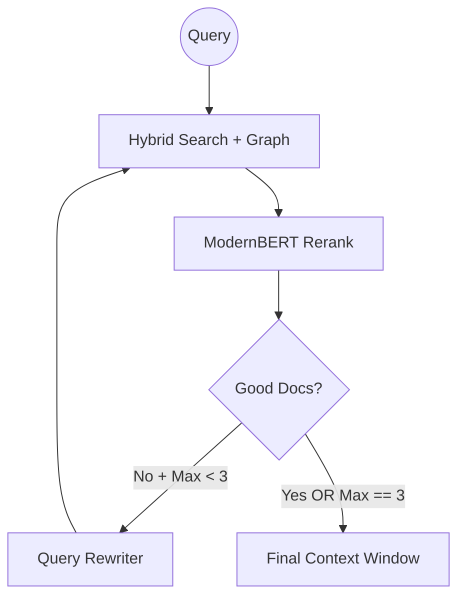

# Chapter 3: Search and Retrieval Mechanics

Retrieval within CodaCite represents the "Engine of Discovery," transitioning from simple keyword matching to a sophisticated, agentic process that reasons about its own quality. This chapter explores the physics of Hybrid Search and the mechanics of the self-correcting **LangGraph** retrieval loop.

## 3.1 Hybrid Search: The Dual-Path Strategy

To achieve high precision (exact terminology) and high recall (conceptual meaning), CodaCite employs a **Hybrid Search** strategy in SurrealDB.

Unlike traditional RAG, CodaCite's retrieval engine combines the strengths of Keyword Search and Vector Search through a **Hybrid Retriever**:

* **BM25 (Lexical)**: Ensures precision for specific entities, acronyms, and technical jargon.
* **Vector (Semantic)**: Captures thematic intent and conceptual similarity, even when keywords do not match.

### Weighted α-Scoring
The final relevance score is a weighted combination of lexical and semantic results:

\[Score = (BM25 \times \alpha) + (CosineSimilarity \times (1 - \alpha))\]

Typically, \(\alpha\) is tuned to 0.4, favoring semantic context while retaining strong keyword anchoring.

## 3.2 The Self-Correcting Retrieval Loop (LangGraph)

CodaCite does not rely on a single, static retrieval call. Instead, it utilizes an agentic loop built on **LangGraph**. This loop mimics the human process of "searching, evaluating, and refining."

### The Retrieval Cycle

1. **Retrieve**: The initial query is vectorized and executed against the Hybrid Index. Simultaneously, the system links query entities to the Knowledge Graph and performs a depth-limited traversal.
2. **Rerank**: A `ModernBERT` cross-encoder reranks all retrieved candidates. This phase applies high-precision filtering (typically >0.3 score) to discard noisy or irrelevant context snippets.
3. **Rewrite (Conditional)**: If the reranking phase determines that no relevant documents were found and the `rewrite_count` is below the limit, the **Query Rewriter** node is triggered. It uses an LLM to optimize the query and restarts the loop.
4. **Final Synthesis**: Once relevant context is secured, the documents are returned as the grounded context window for generation.

## 3.3 Graph-Enforced Scoping

Retrieval is strictly constrained by the **Notebook Scope**. When a user selects specific notebooks, the retrieval engine applies a graph filter:

* **O(1) RecordID Fetches**: The system uses SurrealDB's direct `RecordID` fetching for partition-based filtering, minimizing join latency during the LangGraph loop.
* **Security & Relevance**: This ensures that context from unrelated projects does not "bleed" into the current analysis, maintaining strict logical isolation.

```mermaid
graph TD
    START((Query)) --> RETRIEVE[Hybrid Search + Graph]
    RETRIEVE --> RERANK[ModernBERT Rerank]
    RERANK --> GRADE{Good Docs?}

    GRADE -- "No + Max < 3" --> REWRITE[Query Rewriter]
    REWRITE --> RETRIEVE

    GRADE -- "Yes OR Max == 3" --> END[Final Context Window]
```
