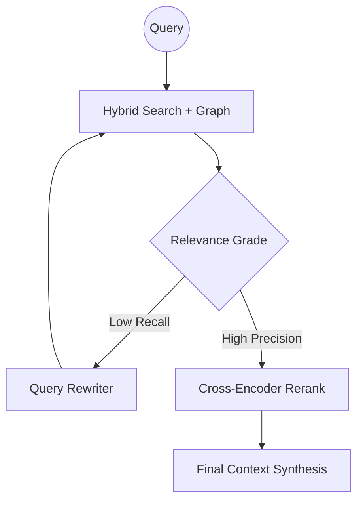

# Chapter 3: Search and Retrieval Mechanics

Retrieval within CodaCite represents the "Engine of Discovery," transitioning from simple keyword matching to a sophisticated, agentic process that reasons about its own quality. This chapter explores the physics of Hybrid Search and the mechanics of the self-correcting **LangGraph** retrieval loop.

## 3.1 Hybrid Search: The Dual-Path Strategy

To achieve high precision (exact terminology) and high recall (conceptual meaning), CodaCite employs a **Hybrid Search** strategy in SurrealDB.

Unlike traditional RAG, CodaCite's retrieval engine combines the strengths of Keyword Search and Vector Search through a **Hybrid Retriever**:

* **BM25 (Lexical)**: Ensures precision for specific entities, acronyms, and technical jargon.
* **Vector (Semantic)**: Captures thematic intent and conceptual similarity, even when keywords do not match.

### Weighted α-Scoring
The final relevance score is a weighted combination of lexical and semantic results:

\[Score = (BM25 \times \alpha) + (CosineSimilarity \times (1 - \alpha))\]

Typically, \(\alpha\) is tuned to 0.4, favoring semantic context while retaining strong keyword anchoring.

## 3.2 The Self-Correcting Retrieval Loop (LangGraph)

CodaCite does not rely on a single, static retrieval call. Instead, it utilizes an agentic loop built on **LangGraph**. This loop mimics the human process of "searching, evaluating, and refining."

### The Retrieval Cycle

1. **Retrieve**: The initial query is vectorized and executed against the Hybrid Index and the Knowledge Graph neighborhood.
2. **Grade**: A reasoning model (local LLM) evaluates every retrieved context snippet. It assigns a binary "Relevant/Irrelevant" grade based on the specific requirements of the user's query.
3. **Rewrite (The Self-Correction)**: If the grading phase determines that the retrieved context is insufficient to answer the query, the "Rewriter" agent is triggered. It rephrases the user's query into a more search-optimized form and restarts the loop.
4. **Aggregate & Rerank**: Once sufficient relevant context is gathered, a Cross-Encoder reranker performs a final, high-precision sort to ensure the most critical evidence is placed at the top of the context window.

## 3.3 Graph-Enforced Scoping

Retrieval is strictly constrained by the **Notebook Scope**. When a user selects specific notebooks, the retrieval engine applies a graph filter:

* **Edge Traversal**: Only nodes and chunks connected via `belongs_to` edges to the selected `notebook_ids` are considered.
* **Security & Relevance**: This ensures that context from unrelated projects does not "bleed" into the current analysis, maintaining strict logical isolation.

```mermaid
graph TD
    START((Query)) --> RETRIEVE[Hybrid Search + Graph]
    RETRIEVE --> GRADE{Relevance Grade}

    GRADE -- "Low Recall" --> REWRITE[Query Rewriter]
    REWRITE --> RETRIEVE

    GRADE -- "High Precision" --> RERANK[Cross-Encoder Rerank]
    RERANK --> GEN[Final Context Synthesis]
```
